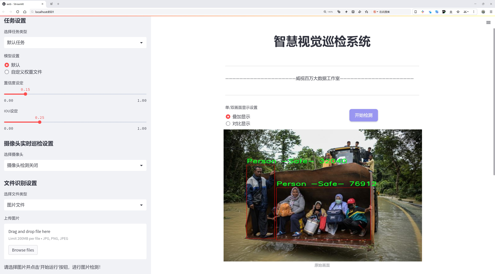
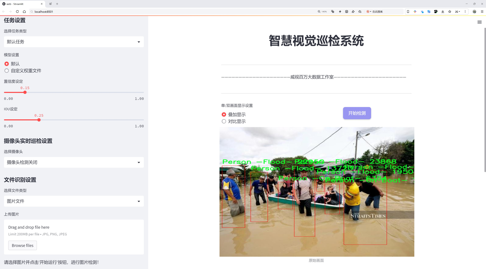
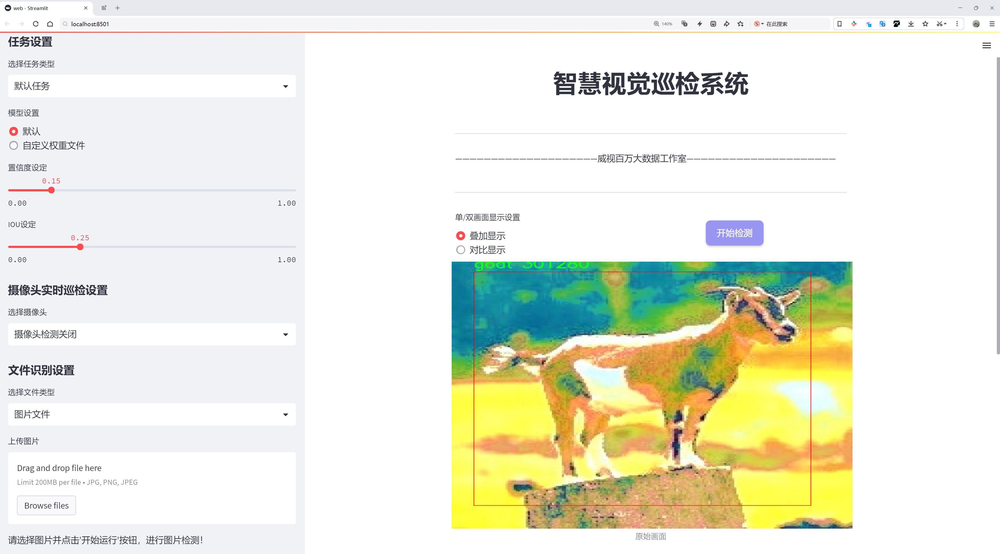
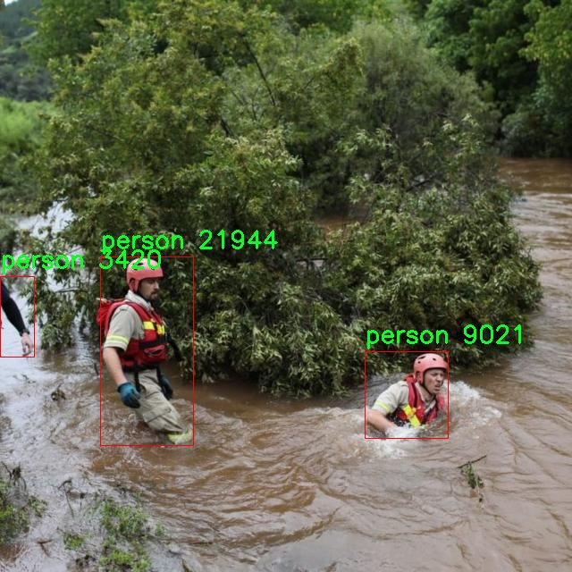
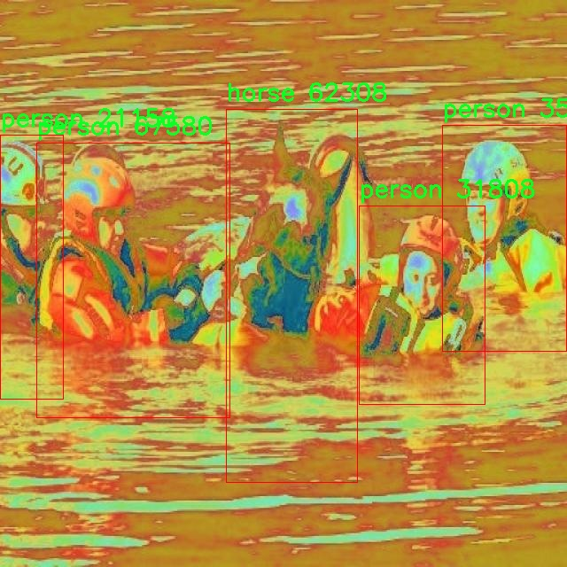
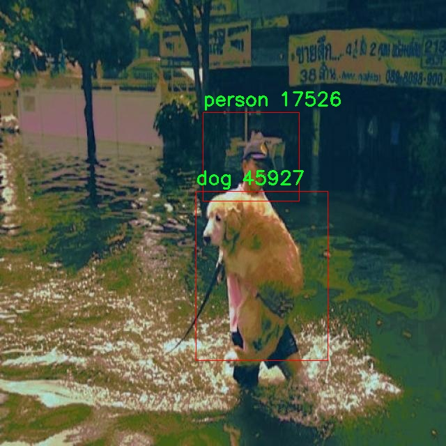

# 洪水灾害场景车辆行人淹水检测系统源码分享
 # [一条龙教学YOLOV8标注好的数据集一键训练_70+全套改进创新点发刊_Web前端展示]

### 1.研究背景与意义

项目参考[AAAI Association for the Advancement of Artificial Intelligence](https://gitee.com/qunmasj/projects)

项目来源[AACV Association for the Advancement of Computer Vision](https://kdocs.cn/l/cszuIiCKVNis)

研究背景与意义

随着全球气候变化的加剧，极端天气事件的频率和强度不断上升，洪水灾害已成为影响人类生存和发展的重要因素之一。根据世界气象组织的报告，洪水不仅造成了巨大的经济损失，还对人类生命安全构成了严重威胁。在这一背景下，及时、准确地识别和监测洪水灾害场景中的车辆和行人，尤其是被淹没的个体，显得尤为重要。传统的洪水监测手段往往依赖于人工巡查和简单的图像分析，效率低下且容易受到主观因素的影响。因此，基于先进的计算机视觉技术，尤其是深度学习模型的应用，成为了提升洪水灾害响应能力的重要途径。

YOLO（You Only Look Once）系列模型因其在实时目标检测中的优越性能而受到广泛关注。YOLOv8作为该系列的最新版本，结合了更为精细的特征提取和高效的推理速度，适合在复杂的洪水场景中进行车辆和行人的检测。通过对YOLOv8的改进，可以进一步提升其在洪水灾害场景下的检测精度和鲁棒性。特别是在面对多样化的淹水状态和不同的环境条件时，改进后的YOLOv8模型能够有效识别被淹没的车辆和行人，从而为救援工作提供及时的信息支持。

本研究将利用“dados_desastre_2”数据集，该数据集包含703幅图像，涵盖了12个类别，包括“Drowning-car”、“Drowning-person”、“Person (Flood)”等。这些类别的多样性为模型的训练提供了丰富的样本，使其能够在不同的洪水场景中进行有效的学习和适应。通过对这些数据的深入分析与处理，可以提取出关键特征，从而提高模型在实际应用中的准确性和可靠性。此外，数据集中对不同状态的行人和车辆的标注，能够帮助模型更好地理解和区分被淹没的个体与安全状态下的个体，为后续的救援决策提供科学依据。

在实际应用中，基于改进YOLOv8的洪水灾害场景车辆行人淹水检测系统不仅可以提高灾后评估的效率，还能在灾害发生初期提供实时监测和预警，帮助相关部门迅速制定应对措施，最大限度地减少人员伤亡和财产损失。同时，该系统的开发与应用将为未来的智能城市建设提供借鉴，推动城市在面对自然灾害时的韧性提升。

综上所述，本研究的意义在于通过改进YOLOv8模型，构建一个高效的洪水灾害场景检测系统，不仅能为洪水灾害的实时监测和救援提供技术支持，还能为相关领域的研究提供新的思路和方法。随着技术的不断进步和数据集的丰富，该系统有望在未来的灾害管理中发挥更为重要的作用，为人类的安全与发展保驾护航。

### 2.图片演示







##### 注意：由于此博客编辑较早，上面“2.图片演示”和“3.视频演示”展示的系统图片或者视频可能为老版本，新版本在老版本的基础上升级如下：（实际效果以升级的新版本为准）

  （1）适配了YOLOV8的“目标检测”模型和“实例分割”模型，通过加载相应的权重（.pt）文件即可自适应加载模型。

  （2）支持“图片识别”、“视频识别”、“摄像头实时识别”三种识别模式。

  （3）支持“图片识别”、“视频识别”、“摄像头实时识别”三种识别结果保存导出，解决手动导出（容易卡顿出现爆内存）存在的问题，识别完自动保存结果并导出到tempDir中。

  （4）支持Web前端系统中的标题、背景图等自定义修改，后面提供修改教程。

  另外本项目提供训练的数据集和训练教程,暂不提供权重文件（best.pt）,需要您按照教程进行训练后实现图片演示和Web前端界面演示的效果。

### 3.视频演示

[3.1 视频演示](https://www.bilibili.com/video/BV1JZ23YdEKq/)

### 4.数据集信息展示

##### 4.1 本项目数据集详细数据（类别数＆类别名）

nc: 12
names: ['Drowning-car', 'Drowning-person', 'Person -Flood-', 'Person -On Boat-', 'Person -On Rooftop-', 'Person -Safe-', 'car', 'cow', 'dog', 'goat', 'horse', 'person']


##### 4.2 本项目数据集信息介绍

数据集信息展示

在现代计算机视觉领域，尤其是在灾害响应和管理方面，深度学习技术的应用正变得愈发重要。为此，我们构建了一个专门用于训练改进YOLOv8的洪水灾害场景车辆行人淹水检测系统的数据集，命名为“dados_desastre_2”。该数据集的设计旨在提高模型在洪水灾害情况下对不同对象的识别能力，从而为灾后救援和资源分配提供更为精准的信息支持。

“dados_desastre_2”数据集包含12个类别，涵盖了洪水场景中可能出现的多种对象。这些类别包括“Drowning-car”（淹水的汽车）、“Drowning-person”（淹水的人）、“Person -Flood-”（在洪水中的人）、“Person -On Boat-”（在船上的人）、“Person -On Rooftop-”（在屋顶上的人）、“Person -Safe-”（安全的人）、“car”（汽车）、“cow”（牛）、“dog”（狗）、“goat”（山羊）、“horse”（马）和“person”（人）。这样的多样性确保了模型能够在复杂的洪水场景中有效识别和分类不同的对象，从而提升救援工作的效率。

在数据集的构建过程中，我们充分考虑了现实世界中洪水灾害的多样性和复杂性。每个类别的样本均来自于真实的洪水场景，涵盖了不同的环境条件、光照变化和视角。这些样本不仅包括了被淹没的车辆和人员，还包括在洪水中安全的个体和动物，这样的设计旨在帮助模型学习到更为细致的特征，从而提高其在实际应用中的鲁棒性。

此外，为了确保数据集的质量和多样性，我们对每个类别进行了精心的标注和审核。标注过程中，使用了专业的标注工具，确保每个对象的边界框和类别标签的准确性。通过这种方式，我们能够为模型提供高质量的训练数据，进而提高其检测精度。

在训练过程中，YOLOv8模型将利用“dados_desastre_2”数据集中的多样化样本进行学习，逐步优化其特征提取和分类能力。我们期望通过对该数据集的深入训练，模型能够在洪水灾害场景中实现快速而准确的检测，及时识别被淹没的车辆和人员，为救援工作提供重要的决策支持。

综上所述，“dados_desastre_2”数据集不仅是一个简单的图像集合，更是一个经过精心设计和构建的资源，旨在推动洪水灾害场景下的计算机视觉研究和应用。通过对这一数据集的深入挖掘和利用，我们相信能够为灾害响应领域带来新的突破，提升救援工作的效率和效果。









### 5.全套项目环境部署视频教程（零基础手把手教学）

[5.1 环境部署教程链接（零基础手把手教学）](https://www.ixigua.com/7404473917358506534?logTag=c807d0cbc21c0ef59de5)


[5.2 安装Python虚拟环境创建和依赖库安装视频教程链接（零基础手把手教学）](https://www.ixigua.com/7404474678003106304?logTag=1f1041108cd1f708b01a)

### 6.手把手YOLOV8训练视频教程（零基础小白有手就能学会）

[6.1 手把手YOLOV8训练视频教程（零基础小白有手就能学会）](https://www.ixigua.com/7404477157818401292?logTag=d31a2dfd1983c9668658)


按照上面的训练视频教程链接加载项目提供的数据集，运行train.py即可开始训练



     Epoch   gpu_mem       box       obj       cls    labels  img_size
     1/200     20.8G   0.01576   0.01955  0.007536        22      1280: 100%|██████████| 849/849 [14:42<00:00,  1.04s/it]
               Class     Images     Labels          P          R     mAP@.5 mAP@.5:.95: 100%|██████████| 213/213 [01:14<00:00,  2.87it/s]
                 all       3395      17314      0.994      0.957      0.0957      0.0843

     Epoch   gpu_mem       box       obj       cls    labels  img_size
     2/200     20.8G   0.01578   0.01923  0.007006        22      1280: 100%|██████████| 849/849 [14:44<00:00,  1.04s/it]
               Class     Images     Labels          P          R     mAP@.5 mAP@.5:.95: 100%|██████████| 213/213 [01:12<00:00,  2.95it/s]
                 all       3395      17314      0.996      0.956      0.0957      0.0845

     Epoch   gpu_mem       box       obj       cls    labels  img_size
     3/200     20.8G   0.01561    0.0191  0.006895        27      1280: 100%|██████████| 849/849 [10:56<00:00,  1.29it/s]
               Class     Images     Labels          P          R     mAP@.5 mAP@.5:.95: 100%|███████   | 187/213 [00:52<00:00,  4.04it/s]
                 all       3395      17314      0.996      0.957      0.0957      0.0845


### 7.70+种全套YOLOV8创新点代码加载调参视频教程（一键加载写好的改进模型的配置文件）

[7.1 70+种全套YOLOV8创新点代码加载调参视频教程（一键加载写好的改进模型的配置文件）](https://www.ixigua.com/7404478314661806627?logTag=29066f8288e3f4eea3a4)

### 8.70+种全套YOLOV8创新点原理讲解（非科班也可以轻松写刊发刊，V10版本正在科研待更新）

#### 由于篇幅限制，每个创新点的具体原理讲解就不一一展开，具体见下列网址中的创新点对应子项目的技术原理博客网址【Blog】：


[8.1 70+种全套YOLOV8创新点原理讲解链接](https://gitee.com/qunmasj/good)

#### 部分改进原理讲解(完整的改进原理见上图和技术博客链接)【如果此小节的图加载失败可以通过CSDN或者Github搜索该博客的标题访问原始博客，原始博客图片显示正常】

### YOLOv8简介
#### Backbone
Darknet-53
53指的是“52层卷积”+output layer。

借鉴了其他算法的这些设计思想

借鉴了VGG的思想，使用了较多的3×3卷积，在每一次池化操作后，将通道数翻倍；

借鉴了network in network的思想，使用全局平均池化（global average pooling）做预测，并把1×1的卷积核置于3×3的卷积核之间，用来压缩特征；（我没找到这一步体现在哪里）


使用了批归一化层稳定模型训练，加速收敛，并且起到正则化作用。

    以上三点为Darknet19借鉴其他模型的点。Darknet53当然是在继承了Darknet19的这些优点的基础上再新增了下面这些优点的。因此列在了这里

借鉴了ResNet的思想，在网络中大量使用了残差连接，因此网络结构可以设计的很深，并且缓解了训练中梯度消失的问题，使得模型更容易收敛。

使用步长为2的卷积层代替池化层实现降采样。（这一点在经典的Darknet-53上是很明显的，output的长和宽从256降到128，再降低到64，一路降低到8，应该是通过步长为2的卷积层实现的；在YOLOv8的卷积层中也有体现，比如图中我标出的这些位置）

#### 特征融合

模型架构图如下

  Darknet-53的特点可以这样概括：（Conv卷积模块+Residual Block残差块）串行叠加4次

  Conv卷积层+Residual Block残差网络就被称为一个stage


上面红色指出的那个，原始的Darknet-53里面有一层 卷积，在YOLOv8里面，把一层卷积移除了

为什么移除呢？

        原始Darknet-53模型中间加的这个卷积层做了什么？滤波器（卷积核）的个数从 上一个卷积层的512个，先增加到1024个卷积核，然后下一层卷积的卷积核的个数又降低到512个

        移除掉这一层以后，少了1024个卷积核，就可以少做1024次卷积运算，同时也少了1024个3×3的卷积核的参数，也就是少了9×1024个参数需要拟合。这样可以大大减少了模型的参数，（相当于做了轻量化吧）

        移除掉这个卷积层，可能是因为作者发现移除掉这个卷积层以后，模型的score有所提升，所以才移除掉的。为什么移除掉以后，分数有所提高呢？可能是因为多了这些参数就容易，参数过多导致模型在训练集删过拟合，但是在测试集上表现很差，最终模型的分数比较低。你移除掉这个卷积层以后，参数减少了，过拟合现象不那么严重了，泛化能力增强了。当然这个是，拿着你做实验的结论，反过来再找补，再去强行解释这种现象的合理性。


通过MMdetection官方绘制册这个图我们可以看到，进来的这张图片经过一个“Feature Pyramid Network(简称FPN)”，然后最后的P3、P4、P5传递给下一层的Neck和Head去做识别任务。 PAN（Path Aggregation Network）


“FPN是自顶向下，将高层的强语义特征传递下来。PAN就是在FPN的后面添加一个自底向上的金字塔，对FPN补充，将低层的强定位特征传递上去，

FPN是自顶（小尺寸，卷积次数多得到的结果，语义信息丰富）向下（大尺寸，卷积次数少得到的结果），将高层的强语义特征传递下来，对整个金字塔进行增强，不过只增强了语义信息，对定位信息没有传递。PAN就是针对这一点，在FPN的后面添加一个自底（卷积次数少，大尺寸）向上（卷积次数多，小尺寸，语义信息丰富）的金字塔，对FPN补充，将低层的强定位特征传递上去，又被称之为“双塔战术”。

FPN层自顶向下传达强语义特征，而特征金字塔则自底向上传达强定位特征，两两联手，从不同的主干层对不同的检测层进行参数聚合,这样的操作确实很皮。
#### 自底向上增强


而 PAN（Path Aggregation Network）是对 FPN 的一种改进，它的设计理念是在 FPN 后面添加一个自底向上的金字塔。PAN 引入了路径聚合的方式，通过将浅层特征图（低分辨率但语义信息较弱）和深层特征图（高分辨率但语义信息丰富）进行聚合，并沿着特定的路径传递特征信息，将低层的强定位特征传递上去。这样的操作能够进一步增强多尺度特征的表达能力，使得 PAN 在目标检测任务中表现更加优秀。


### Gold-YOLO简介
YOLO系列模型面世至今已有8年，由于其优异的性能，已成为目标检测领域的标杆。在系列模型经过十多个不同版本的改进发展逐渐稳定完善的今天，研究人员更多关注于单个计算模块内结构的精细调整，或是head部分和训练方法上的改进。但这并不意味着现有模式已是最优解。

当前YOLO系列模型通常采用类FPN方法进行信息融合，而这一结构在融合跨层信息时存在信息损失的问题。针对这一问题，我们提出了全新的信息聚集-分发（Gather-and-Distribute Mechanism）GD机制，通过在全局视野上对不同层级的特征进行统一的聚集融合并分发注入到不同层级中，构建更加充分高效的信息交互融合机制，并基于GD机制构建了Gold-YOLO。在COCO数据集中，我们的Gold-YOLO超越了现有的YOLO系列，实现了精度-速度曲线上的SOTA。


精度和速度曲线（TensorRT7）


精度和速度曲线（TensorRT8）
传统YOLO的问题
在检测模型中，通常先经过backbone提取得到一系列不同层级的特征，FPN利用了backbone的这一特点，构建了相应的融合结构：不层级的特征包含着不同大小物体的位置信息，虽然这些特征包含的信息不同，但这些特征在相互融合后能够互相弥补彼此缺失的信息，增强每一层级信息的丰富程度，提升网络性能。

原始的FPN结构由于其层层递进的信息融合模式，使得相邻层的信息能够充分融合，但也导致了跨层信息融合存在问题：当跨层的信息进行交互融合时，由于没有直连的交互通路，只能依靠中间层充当“中介”进行融合，导致了一定的信息损失。之前的许多工作中都关注到了这一问题，而解决方案通常是通过添加shortcut增加更多的路径，以增强信息流动。

然而传统的FPN结构即便改进后，由于网络中路径过多，且交互方式不直接，基于FPN思想的信息融合结构仍然存在跨层信息交互困难和信息损失的问题。

#### Gold-YOLO：全新的信息融合交互机制


#### Gold-YOLO架构
参考该博客提出的一种全新的信息交互融合机制：信息聚集-分发机制(Gather-and-Distribute Mechanism)。该机制通过在全局上融合不同层次的特征得到全局信息，并将全局信息注入到不同层级的特征中，实现了高效的信息交互和融合。在不显著增加延迟的情况下GD机制显著增强了Neck部分的信息融合能力，提高了模型对不同大小物体的检测能力。

GD机制通过三个模块实现：信息对齐模块(FAM)、信息融合模块(IFM)和信息注入模块(Inject)。

信息对齐模块负责收集并对齐不同层级不同大小的特征

信息融合模块通过使用卷积或Transformer算子对对齐后的的特征进行融合，得到全局信息

信息注入模块将全局信息注入到不同层级中

在Gold-YOLO中，针对模型需要检测不同大小的物体的需要，并权衡精度和速度，我们构建了两个GD分支对信息进行融合：低层级信息聚集-分发分支(Low-GD)和高层级信息聚集-分发分支(High-GD)，分别基于卷积和transformer提取和融合特征信息。

此外,为了促进局部信息的流动，我们借鉴现有工作，构建了一个轻量级的邻接层融合模块，该模块在局部尺度上结合了邻近层的特征，进一步提升了模型性能。我们还引入并验证了预训练方法对YOLO模型的有效性，通过在ImageNet 1K上使用MAE方法对主干进行预训练，显著提高了模型的收敛速度和精度。


### 9.系统功能展示（检测对象为举例，实际内容以本项目数据集为准）

图9.1.系统支持检测结果表格显示

  图9.2.系统支持置信度和IOU阈值手动调节

  图9.3.系统支持自定义加载权重文件best.pt(需要你通过步骤5中训练获得)

  图9.4.系统支持摄像头实时识别

  图9.5.系统支持图片识别

  图9.6.系统支持视频识别

  图9.7.系统支持识别结果文件自动保存

  图9.8.系统支持Excel导出检测结果数据


### 10.原始YOLOV8算法原理

原始YOLOv8算法原理

YOLOv8作为目标检测领域的最新代表作，自2023年1月由Ultralytics发布以来，迅速引起了广泛关注。它不仅继承了前几代YOLO模型的优良特性，还结合了YOLOX、YOLOv6、YOLOv7和PPYOLOE等算法的设计理念，形成了一种全新的检测框架。YOLOv8的设计旨在解决目标检测中的速度与精度之间的矛盾，使其在实时检测任务中表现出色。

YOLOv8的网络结构由三部分组成：Backbone、Neck和Head。Backbone部分负责特征提取，通常采用深度卷积神经网络（CNN），以从输入图像中提取多层次的特征信息。通过使用更深和更宽的网络结构，YOLOv8能够捕捉到更丰富的上下文信息，从而提高检测的准确性。Neck部分则是特征融合的关键，旨在将来自不同层次的特征进行有效整合，以便后续的目标检测任务。YOLOv8在这一部分的设计上进行了创新，采用了跨层连接的方式，使得不同尺度的特征能够相互补充，增强了模型对小目标的检测能力。

Head部分是YOLOv8的核心，它通过解耦的方式实现了目标检测信息的输出。与以往版本不同，YOLOv8的Head设计了三个独立的输出头，分别负责不同类别的目标检测。这种解耦设计使得模型在处理复杂场景时能够更灵活地应对多样化的目标，从而提升了整体的检测性能。每个头部都使用了改进的损失函数，结合了目标的定位和分类信息，使得模型在训练过程中能够更有效地学习到目标的特征。

在模型设置方面，YOLOv8引入了depth_factor、width_factor和ratio等参数，以便用户根据具体需求调整模型的深度和宽度。这种灵活性使得YOLOv8能够适应不同的应用场景，从嵌入式设备到高性能服务器，均能找到合适的模型配置。通过调整这些参数，用户可以在保证检测精度的前提下，优化模型的推理速度和资源消耗。

YOLOv8的另一个显著特点是其对自定义数据集的原生支持。这一特性极大地方便了研究人员和开发者在特定领域的应用，例如农业、医疗、安防等。以苹果采摘为例，利用YOLOv8的视觉识别能力，自动检测和定位苹果，能够有效提高采摘效率，降低人力成本。通过与蚁群算法结合，进一步优化路径规划，确保自动采摘机器人能够在复杂环境中快速、准确地完成任务。

在实际应用中，YOLOv8的高精度和快速推理能力使其成为目标检测领域的一个重要里程碑。无论是在工业自动化、智能监控，还是在无人驾驶、机器人技术等前沿领域，YOLOv8都展现出了强大的适应性和实用性。随着YOLOv8的不断发展和完善，预计将会在更多的应用场景中发挥重要作用，推动目标检测技术的进一步进步。

综上所述，YOLOv8不仅在算法设计上进行了多方面的创新，还在实际应用中展现了极大的潜力。其灵活的模型设置、强大的特征提取能力以及高效的损失函数设计，使得YOLOv8在目标检测领域达到了一个新的高度。未来，随着更多研究者和开发者的参与，YOLOv8有望在更多的领域中实现突破，推动智能化技术的快速发展。


### 11.项目核心源码讲解（再也不用担心看不懂代码逻辑）

#### 11.1 code\ultralytics\utils\torch_utils.py

以下是对您提供的代码进行的核心部分提取和详细中文注释。该代码主要涉及深度学习模型的训练和推理过程中的一些实用工具和功能。

```python
import math
import os
import platform
import random
import time
from contextlib import contextmanager
from copy import deepcopy
from pathlib import Path
import torch
import torch.nn as nn
import torch.nn.functional as F
import torchvision

# 检查 PyTorch 版本
TORCH_1_9 = torch.__version__ >= "1.9.0"
TORCH_2_0 = torch.__version__ >= "2.0.0"

@contextmanager
def torch_distributed_zero_first(local_rank: int):
    """在分布式训练中，确保所有进程在本地主进程完成某些操作之前等待。"""
    initialized = torch.distributed.is_available() and torch.distributed.is_initialized()
    if initialized and local_rank not in (-1, 0):
        torch.distributed.barrier(device_ids=[local_rank])  # 等待本地主进程
    yield
    if initialized and local_rank == 0:
        torch.distributed.barrier(device_ids=[0])  # 主进程完成后，其他进程继续

def select_device(device="", batch=0, verbose=True):
    """
    根据提供的参数选择合适的 PyTorch 设备。
    
    Args:
        device (str | torch.device, optional): 设备字符串或 torch.device 对象。
        batch (int, optional): 模型使用的批大小。
        verbose (bool, optional): 如果为 True，则记录设备信息。

    Returns:
        (torch.device): 选择的设备。
    """
    if isinstance(device, torch.device):
        return device

    device = str(device).lower()
    cpu = device == "cpu"
    if cpu:
        os.environ["CUDA_VISIBLE_DEVICES"] = "-1"  # 强制使用 CPU
    else:
        if not torch.cuda.is_available():
            raise ValueError("CUDA devices are not available.")
        os.environ["CUDA_VISIBLE_DEVICES"] = device  # 设置可见的 CUDA 设备

    selected_device = "cuda:0" if torch.cuda.is_available() else "cpu"
    if verbose:
        print(f"Using device: {selected_device}")
    return torch.device(selected_device)

def fuse_conv_and_bn(conv, bn):
    """融合 Conv2d() 和 BatchNorm2d() 层以提高推理速度。"""
    fusedconv = nn.Conv2d(
        conv.in_channels,
        conv.out_channels,
        kernel_size=conv.kernel_size,
        stride=conv.stride,
        padding=conv.padding,
        bias=True,
    ).requires_grad_(False).to(conv.weight.device)

    # 准备卷积和 BatchNorm 的权重
    w_conv = conv.weight.clone().view(conv.out_channels, -1)
    w_bn = torch.diag(bn.weight / torch.sqrt(bn.running_var + bn.eps))
    fusedconv.weight.copy_(torch.mm(w_bn, w_conv).view(fusedconv.weight.shape))

    # 准备偏置
    b_conv = conv.bias if conv.bias is not None else torch.zeros(conv.out_channels, device=conv.weight.device)
    b_bn = bn.bias - bn.weight * bn.running_mean / torch.sqrt(bn.running_var + bn.eps)
    fusedconv.bias.copy_(torch.mm(w_bn, b_conv.view(-1, 1)).view(-1) + b_bn)

    return fusedconv

def model_info(model, detailed=False, verbose=True):
    """
    打印模型信息，包括参数数量和层数。

    Args:
        model: 要打印信息的模型。
        detailed (bool): 是否打印详细信息。
        verbose (bool): 是否输出信息。
    """
    if not verbose:
        return
    n_p = sum(p.numel() for p in model.parameters())  # 参数总数
    n_l = len(list(model.modules()))  # 层数
    if detailed:
        print(f"{'layer':>5} {'name':>40} {'parameters':>12}")
        for i, (name, p) in enumerate(model.named_parameters()):
            print(f"{i:5} {name:40} {p.numel():12}")

    print(f"Model summary: {n_l} layers, {n_p} parameters")
    return n_l, n_p

def initialize_weights(model):
    """初始化模型权重为随机值。"""
    for m in model.modules():
        if isinstance(m, nn.Conv2d):
            nn.init.kaiming_normal_(m.weight, mode='fan_out', nonlinearity='relu')
        elif isinstance(m, nn.BatchNorm2d):
            m.eps = 1e-3
            m.momentum = 0.03

def time_sync():
    """同步时间以确保在多 GPU 环境中准确计时。"""
    if torch.cuda.is_available():
        torch.cuda.synchronize()
    return time.time()

class EarlyStopping:
    """早停类，当指定的 epochs 数量过去而没有改进时停止训练。"""

    def __init__(self, patience=50):
        """初始化早停对象。"""
        self.best_fitness = 0.0  # 最佳适应度
        self.best_epoch = 0
        self.patience = patience  # 允许的无改进 epochs 数量

    def __call__(self, epoch, fitness):
        """检查是否停止训练。"""
        if fitness is None:
            return False

        if fitness >= self.best_fitness:  # 如果当前适应度更好
            self.best_epoch = epoch
            self.best_fitness = fitness
        stop = (epoch - self.best_epoch) >= self.patience  # 检查是否超过耐心值
        if stop:
            print(f"Stopping training early at epoch {epoch}. Best fitness: {self.best_fitness}")
        return stop
```

### 主要功能概述
1. **设备选择**：`select_device` 函数用于选择合适的计算设备（CPU或GPU）。
2. **模型融合**：`fuse_conv_and_bn` 函数用于将卷积层和批归一化层融合，以提高推理速度。
3. **模型信息**：`model_info` 函数用于打印模型的参数数量和层数。
4. **权重初始化**：`initialize_weights` 函数用于初始化模型的权重。
5. **时间同步**：`time_sync` 函数用于在多GPU环境中同步时间。
6. **早停机制**：`EarlyStopping` 类用于在训练过程中监控模型性能，并在性能不再提升时提前停止训练。

以上是对代码的核心部分提取和详细注释，旨在帮助理解代码的功能和实现逻辑。

这个文件 `torch_utils.py` 是 Ultralytics YOLO 项目的一部分，主要用于处理与 PyTorch 相关的各种实用功能和工具。代码中包含了多个函数和类，涉及模型训练、设备选择、模型信息获取、参数初始化、图像处理等多个方面。

首先，文件导入了一些必要的库，包括 `math`、`os`、`platform`、`random`、`time` 等标准库，以及 `torch` 和 `torchvision` 等深度学习相关库。它还导入了一些 Ultralytics 自定义的工具和配置，如 `DEFAULT_CFG_DICT` 和 `LOGGER`。

文件中定义了多个函数。`torch_distributed_zero_first` 是一个上下文管理器，用于在分布式训练中确保所有进程在本地主进程完成某些操作之前都处于等待状态。`smart_inference_mode` 函数根据 PyTorch 的版本选择合适的推理模式装饰器，以提高推理效率。

`select_device` 函数用于选择合适的 PyTorch 设备（CPU 或 GPU），并根据用户的输入验证设备的可用性。如果请求的设备不可用，它会抛出异常。这个函数还会设置环境变量 `CUDA_VISIBLE_DEVICES`，以控制可见的 GPU。

`time_sync` 函数用于同步 CUDA 时间，确保在使用 GPU 时准确测量时间。`fuse_conv_and_bn` 和 `fuse_deconv_and_bn` 函数用于将卷积层和批归一化层融合，以提高模型的推理速度。

`model_info` 函数提供了模型的详细信息，包括参数数量、梯度数量和层数。`get_num_params` 和 `get_num_gradients` 函数分别返回模型的参数总数和具有梯度的参数总数。

`initialize_weights` 函数用于初始化模型的权重，确保模型在训练开始时具有合理的初始值。`scale_img` 函数用于根据给定的比例和网格大小调整和填充图像张量。

`strip_optimizer` 函数用于从训练好的模型中去除优化器信息，以便于模型的部署和推理。`profile` 函数用于分析模型的速度、内存和计算量（FLOPs），帮助开发者了解模型的性能。

此外，文件中还定义了 `ModelEMA` 类，用于实现模型的指数移动平均（EMA），以提高模型的稳定性和性能。`EarlyStopping` 类用于在训练过程中监控模型的性能，并在没有改进时提前停止训练。

总体而言，这个文件提供了许多实用的工具和功能，旨在支持 YOLO 模型的训练和推理，提升用户的开发体验和模型性能。

#### 11.2 code\ultralytics\data\explorer\__init__.py

以下是代码中最核心的部分，并附上详细的中文注释：

```python
# 导入必要的工具函数
from .utils import plot_query_result

# 定义模块的公开接口
__all__ = ["plot_query_result"]
```

### 代码注释说明：

1. `from .utils import plot_query_result`：
   - 这一行代码从当前包的 `utils` 模块中导入了 `plot_query_result` 函数。这里的 `.` 表示当前包，意味着 `utils` 是与当前模块同级的一个模块。
   - `plot_query_result` 函数可能用于绘制查询结果，具体功能取决于 `utils` 模块的实现。

2. `__all__ = ["plot_query_result"]`：
   - 这一行定义了模块的公开接口，即当使用 `from module import *` 语句时，只有 `plot_query_result` 函数会被导入。
   - 通过定义 `__all__`，可以控制模块的导出内容，避免不必要的内部实现细节被外部访问。

整体来说，这段代码的主要功能是导入一个工具函数并定义模块的公开接口，确保用户在使用该模块时只接触到必要的部分。

这个程序文件是一个Python模块，属于Ultralytics YOLO项目的一部分。文件的主要功能是导入并暴露一个名为`plot_query_result`的函数，供其他模块使用。

首先，文件开头的注释部分表明这是Ultralytics YOLO项目的一部分，并且该项目遵循AGPL-3.0许可证。这意味着该项目是开源的，用户可以自由使用、修改和分发，但需要遵循相应的许可证条款。

接下来，代码中使用了相对导入的方式，从同一包中的`utils`模块导入了`plot_query_result`函数。这种导入方式表明`plot_query_result`函数是在同一目录下的`utils.py`文件中定义的。

最后，`__all__`变量被定义为一个列表，包含了`plot_query_result`。这个变量的作用是控制当使用`from module import *`语句时，哪些名称会被导入。通过定义`__all__`，模块明确了它希望暴露给外部的接口，避免不必要的名称冲突或混淆。

总体来说，这个文件的结构简单明了，主要用于组织和管理模块的导入与导出，确保代码的可读性和可维护性。

#### 11.3 ui.py

```python
import sys
import subprocess

def run_script(script_path):
    """
    使用当前 Python 环境运行指定的脚本。

    Args:
        script_path (str): 要运行的脚本路径

    Returns:
        None
    """
    # 获取当前 Python 解释器的路径
    python_path = sys.executable

    # 构建运行命令
    command = f'"{python_path}" -m streamlit run "{script_path}"'

    # 执行命令
    result = subprocess.run(command, shell=True)
    if result.returncode != 0:
        print("脚本运行出错。")


# 实例化并运行应用
if __name__ == "__main__":
    # 指定您的脚本路径
    script_path = "web.py"  # 这里可以直接指定脚本名称

    # 运行脚本
    run_script(script_path)
```

### 代码注释说明：

1. **导入模块**：
   - `import sys`：导入 `sys` 模块，用于访问与 Python 解释器紧密相关的变量和函数。
   - `import subprocess`：导入 `subprocess` 模块，用于创建新进程、连接到它们的输入/输出/错误管道，并获取它们的返回码。

2. **定义 `run_script` 函数**：
   - 该函数接受一个参数 `script_path`，表示要运行的 Python 脚本的路径。
   - 函数内部首先获取当前 Python 解释器的路径，以便后续执行命令时使用。

3. **构建命令**：
   - 使用格式化字符串构建运行命令，命令的形式为：`python -m streamlit run script_path`，其中 `script_path` 是要运行的脚本。

4. **执行命令**：
   - 使用 `subprocess.run` 方法执行构建的命令，并将 `shell` 参数设置为 `True`，允许在 shell 中执行命令。
   - 检查命令的返回码，如果返回码不为 0，表示脚本运行出错，打印错误信息。

5. **主程序入口**：
   - 使用 `if __name__ == "__main__":` 判断当前模块是否为主程序。
   - 指定要运行的脚本路径，这里直接使用脚本名称 `web.py`。
   - 调用 `run_script` 函数，传入脚本路径以执行该脚本。

这个程序文件的主要功能是通过当前的 Python 环境来运行一个指定的脚本，具体是使用 Streamlit 这个库来启动一个 Web 应用。程序首先导入了必要的模块，包括 `sys`、`os` 和 `subprocess`，这些模块分别用于获取系统信息、处理文件路径和执行外部命令。

在 `run_script` 函数中，首先获取当前 Python 解释器的路径，这样可以确保在正确的环境中运行脚本。接着，构建一个命令字符串，该命令使用 Streamlit 来运行指定的脚本路径。命令的格式是将 Python 解释器与 `-m streamlit run` 和脚本路径结合起来。

随后，使用 `subprocess.run` 方法执行这个命令。如果脚本运行过程中出现错误，返回的结果码将不为零，程序会打印出“脚本运行出错”的提示信息。

在文件的最后部分，程序通过 `if __name__ == "__main__":` 语句来判断是否是直接运行该文件。如果是，则指定要运行的脚本路径，这里是通过 `abs_path` 函数获取的 `web.py` 的绝对路径。最后，调用 `run_script` 函数来执行这个脚本。

整体来看，这个程序提供了一种简便的方式来启动一个基于 Streamlit 的 Web 应用，确保在当前 Python 环境中正确运行。

#### 11.4 train.py

以下是经过简化并添加详细中文注释的核心代码部分：

```python
import random
import numpy as np
import torch.nn as nn
from ultralytics.data import build_dataloader, build_yolo_dataset
from ultralytics.engine.trainer import BaseTrainer
from ultralytics.models import yolo
from ultralytics.nn.tasks import DetectionModel
from ultralytics.utils import LOGGER, RANK
from ultralytics.utils.torch_utils import de_parallel, torch_distributed_zero_first

class DetectionTrainer(BaseTrainer):
    """
    基于检测模型的训练类，继承自BaseTrainer类。
    """

    def build_dataset(self, img_path, mode="train", batch=None):
        """
        构建YOLO数据集。

        参数:
            img_path (str): 包含图像的文件夹路径。
            mode (str): 模式，可以是'train'或'val'，用于自定义不同的增强方式。
            batch (int, optional): 批次大小，仅用于'rect'模式。默认为None。
        """
        gs = max(int(de_parallel(self.model).stride.max() if self.model else 0), 32)
        return build_yolo_dataset(self.args, img_path, batch, self.data, mode=mode, rect=mode == "val", stride=gs)

    def get_dataloader(self, dataset_path, batch_size=16, rank=0, mode="train"):
        """构造并返回数据加载器。"""
        assert mode in ["train", "val"]
        with torch_distributed_zero_first(rank):  # 仅在DDP中初始化数据集*.cache一次
            dataset = self.build_dataset(dataset_path, mode, batch_size)
        shuffle = mode == "train"  # 训练模式下打乱数据
        workers = self.args.workers if mode == "train" else self.args.workers * 2
        return build_dataloader(dataset, batch_size, workers, shuffle, rank)  # 返回数据加载器

    def preprocess_batch(self, batch):
        """对图像批次进行预处理，包括缩放和转换为浮点数。"""
        batch["img"] = batch["img"].to(self.device, non_blocking=True).float() / 255  # 将图像转换为浮点数并归一化
        if self.args.multi_scale:  # 如果启用多尺度
            imgs = batch["img"]
            sz = (
                random.randrange(self.args.imgsz * 0.5, self.args.imgsz * 1.5 + self.stride)
                // self.stride
                * self.stride
            )  # 随机选择图像大小
            sf = sz / max(imgs.shape[2:])  # 计算缩放因子
            if sf != 1:
                ns = [
                    math.ceil(x * sf / self.stride) * self.stride for x in imgs.shape[2:]
                ]  # 计算新的图像形状
                imgs = nn.functional.interpolate(imgs, size=ns, mode="bilinear", align_corners=False)  # 进行插值
            batch["img"] = imgs
        return batch

    def get_model(self, cfg=None, weights=None, verbose=True):
        """返回YOLO检测模型。"""
        model = DetectionModel(cfg, nc=self.data["nc"], verbose=verbose and RANK == -1)
        if weights:
            model.load(weights)  # 加载权重
        return model

    def plot_training_samples(self, batch, ni):
        """绘制带有注释的训练样本。"""
        plot_images(
            images=batch["img"],
            batch_idx=batch["batch_idx"],
            cls=batch["cls"].squeeze(-1),
            bboxes=batch["bboxes"],
            paths=batch["im_file"],
            fname=self.save_dir / f"train_batch{ni}.jpg",
            on_plot=self.on_plot,
        )
```

### 代码核心部分说明：
1. **`DetectionTrainer` 类**：这是一个用于训练YOLO检测模型的类，继承自基础训练类 `BaseTrainer`。
2. **`build_dataset` 方法**：构建YOLO数据集，接受图像路径、模式和批次大小作为参数。
3. **`get_dataloader` 方法**：构造数据加载器，负责将数据集加载到模型中，支持训练和验证模式。
4. **`preprocess_batch` 方法**：对输入的图像批次进行预处理，包括归一化和多尺度调整。
5. **`get_model` 方法**：返回一个YOLO检测模型，可以选择性地加载预训练权重。
6. **`plot_training_samples` 方法**：绘制训练样本及其注释，便于可视化训练过程中的数据。

这些方法和类是YOLO模型训练的核心部分，负责数据的准备、模型的构建和训练样本的可视化。

这个程序文件 `train.py` 是一个用于训练 YOLO（You Only Look Once）目标检测模型的 Python 脚本，继承自 `BaseTrainer` 类。它主要负责构建数据集、创建数据加载器、预处理图像、设置模型属性、获取模型、验证模型、记录损失、显示训练进度以及绘制训练样本和指标。

首先，`DetectionTrainer` 类通过重写多个方法来实现特定于目标检测的功能。在构建数据集时，`build_dataset` 方法根据给定的图像路径和模式（训练或验证）来构建 YOLO 数据集，并允许用户为不同模式自定义数据增强。`get_dataloader` 方法则负责创建数据加载器，确保在分布式训练时只初始化一次数据集。

在处理批次数据时，`preprocess_batch` 方法将图像缩放并转换为浮点数，支持多尺度训练。它会根据设定的图像大小随机选择一个新的尺寸，并对图像进行插值处理，以确保图像尺寸符合模型要求。

`set_model_attributes` 方法用于设置模型的属性，包括类别数量和类别名称，以便模型能够正确处理输入数据。`get_model` 方法返回一个 YOLO 检测模型实例，并可选择加载预训练权重。

在验证模型时，`get_validator` 方法返回一个用于验证的对象，并定义了损失名称。`label_loss_items` 方法则用于返回带有标签的训练损失字典，便于监控训练过程中的损失变化。

为了跟踪训练进度，`progress_string` 方法格式化输出当前的训练状态，包括当前的 epoch、GPU 内存使用情况、损失值、实例数量和图像大小。`plot_training_samples` 方法用于绘制训练样本及其注释，以便可视化训练数据的质量。

最后，`plot_metrics` 和 `plot_training_labels` 方法分别用于绘制训练过程中的指标和创建带标签的训练图，以帮助分析模型的训练效果和性能。

总体而言，这个脚本提供了一个完整的框架，用于训练 YOLO 模型，支持多种功能，如数据加载、预处理、模型设置、训练监控和结果可视化。

#### 11.5 70+种YOLOv8算法改进源码大全和调试加载训练教程（非必要）\ultralytics\models\yolo\classify\train.py

以下是代码中最核心的部分，并附上详细的中文注释：

```python
import torch
from ultralytics.data import ClassificationDataset, build_dataloader
from ultralytics.engine.trainer import BaseTrainer
from ultralytics.models import yolo
from ultralytics.nn.tasks import ClassificationModel, attempt_load_one_weight
from ultralytics.utils import DEFAULT_CFG, LOGGER, RANK, colorstr
from ultralytics.utils.torch_utils import is_parallel, strip_optimizer, torch_distributed_zero_first

class ClassificationTrainer(BaseTrainer):
    """
    继承自 BaseTrainer 类的分类训练器，用于基于分类模型的训练。
    """

    def __init__(self, cfg=DEFAULT_CFG, overrides=None, _callbacks=None):
        """初始化 ClassificationTrainer 对象，支持配置覆盖和回调函数。"""
        if overrides is None:
            overrides = {}
        overrides['task'] = 'classify'  # 设置任务类型为分类
        if overrides.get('imgsz') is None:
            overrides['imgsz'] = 224  # 默认图像大小为224
        super().__init__(cfg, overrides, _callbacks)  # 调用父类构造函数

    def set_model_attributes(self):
        """从加载的数据集中设置 YOLO 模型的类名。"""
        self.model.names = self.data['names']  # 将数据集中的类名赋值给模型

    def get_model(self, cfg=None, weights=None, verbose=True):
        """返回配置好的 PyTorch 模型以进行 YOLO 训练。"""
        model = ClassificationModel(cfg, nc=self.data['nc'], verbose=verbose and RANK == -1)  # 创建分类模型
        if weights:
            model.load(weights)  # 加载权重

        for m in model.modules():
            if not self.args.pretrained and hasattr(m, 'reset_parameters'):
                m.reset_parameters()  # 重置模型参数
            if isinstance(m, torch.nn.Dropout) and self.args.dropout:
                m.p = self.args.dropout  # 设置 dropout 概率
        for p in model.parameters():
            p.requires_grad = True  # 设置为可训练
        return model

    def build_dataset(self, img_path, mode='train', batch=None):
        """根据图像路径和模式（训练/测试等）创建 ClassificationDataset 实例。"""
        return ClassificationDataset(root=img_path, args=self.args, augment=mode == 'train', prefix=mode)

    def get_dataloader(self, dataset_path, batch_size=16, rank=0, mode='train'):
        """返回用于推理的 PyTorch DataLoader，并对图像进行预处理。"""
        with torch_distributed_zero_first(rank):  # 在分布式训练中，确保数据集只初始化一次
            dataset = self.build_dataset(dataset_path, mode)  # 构建数据集

        loader = build_dataloader(dataset, batch_size, self.args.workers, rank=rank)  # 创建 DataLoader
        return loader  # 返回 DataLoader

    def preprocess_batch(self, batch):
        """对一批图像和类进行预处理。"""
        batch['img'] = batch['img'].to(self.device)  # 将图像移动到设备上
        batch['cls'] = batch['cls'].to(self.device)  # 将类标签移动到设备上
        return batch

    def get_validator(self):
        """返回用于验证的 ClassificationValidator 实例。"""
        self.loss_names = ['loss']  # 定义损失名称
        return yolo.classify.ClassificationValidator(self.test_loader, self.save_dir)  # 返回验证器

    def final_eval(self):
        """评估训练好的模型并保存验证结果。"""
        for f in self.last, self.best:
            if f.exists():
                strip_optimizer(f)  # 去除优化器信息
                if f is self.best:
                    LOGGER.info(f'\nValidating {f}...')
                    self.metrics = self.validator(model=f)  # 进行验证
                    self.metrics.pop('fitness', None)  # 移除 fitness 指标
        LOGGER.info(f"Results saved to {colorstr('bold', self.save_dir)}")  # 打印结果保存路径
```

### 代码核心部分说明：
1. **导入必要的库**：导入 PyTorch 和 Ultralytics 相关模块。
2. **ClassificationTrainer 类**：该类用于分类模型的训练，继承自 `BaseTrainer`。
3. **初始化方法**：设置任务类型、图像大小等参数。
4. **模型设置**：包括加载模型、设置模型参数等。
5. **数据集和数据加载器**：创建数据集实例并返回相应的 DataLoader，用于训练和验证。
6. **预处理**：将图像和标签移动到指定设备（如 GPU）。
7. **最终评估**：对训练好的模型进行评估，并保存结果。

以上部分是代码的核心逻辑，涵盖了模型训练的主要步骤和功能。

这个程序文件是用于训练基于YOLOv8的分类模型的Python脚本，属于Ultralytics库的一部分。它主要定义了一个名为`ClassificationTrainer`的类，该类继承自`BaseTrainer`，用于处理图像分类任务。

在文件开头，导入了一些必要的库和模块，包括PyTorch、Torchvision以及Ultralytics库中的数据处理、模型训练和工具函数等。这些导入为后续的模型训练和数据处理提供了基础。

`ClassificationTrainer`类的构造函数`__init__`接收一些配置参数，包括模型配置、覆盖参数和回调函数。它会设置任务类型为分类，并默认将输入图像的大小设置为224。如果没有提供其他的覆盖参数，则使用默认配置。

`set_model_attributes`方法用于从加载的数据集中设置YOLO模型的类名。这是模型训练中的一个重要步骤，因为模型需要知道它要分类的对象类别。

`get_model`方法用于返回一个配置好的PyTorch模型，以便进行YOLO训练。它会根据提供的权重加载模型，并对模型的参数进行初始化和设置，以确保它们适合训练。

`setup_model`方法负责加载、创建或下载模型。它会检查模型的类型，支持从本地文件、Torchvision模型或Ultralytics资产中加载模型。如果模型文件不存在，则会抛出一个错误。

`build_dataset`方法用于创建一个`ClassificationDataset`实例，该实例根据给定的图像路径和模式（如训练或测试）来生成数据集。

`get_dataloader`方法返回一个PyTorch的DataLoader，用于对图像进行预处理并准备好供模型进行推理。它会在分布式训练的情况下确保数据集只初始化一次。

`preprocess_batch`方法用于将一批图像和类别数据转移到指定的设备上（如GPU），以便进行训练。

`progress_string`方法返回一个格式化的字符串，显示训练进度，包括当前的轮次、GPU内存使用情况和损失值等信息。

`get_validator`方法返回一个`ClassificationValidator`实例，用于模型验证。它会初始化损失名称，以便在验证过程中进行跟踪。

`label_loss_items`方法用于返回一个带有标签的损失字典，尽管在分类任务中不需要，但在分割和检测任务中是必要的。

`plot_metrics`方法用于从CSV文件中绘制训练过程中的指标，并保存结果图像。

`final_eval`方法用于评估训练好的模型并保存验证结果。它会处理最后的模型文件，剥离优化器信息，并使用验证器对模型进行评估。

最后，`plot_training_samples`方法用于绘制训练样本及其注释，便于可视化训练过程中的数据。

总体来说，这个文件提供了一个完整的框架，用于训练YOLOv8分类模型，包括数据集的构建、模型的加载和训练过程的管理。

#### 11.6 code\ultralytics\hub\utils.py

以下是代码中最核心的部分，并附上详细的中文注释：

```python
import os
import platform
import random
import sys
import threading
import time
from pathlib import Path
import requests

# 定义Ultralytics Hub的API和Web根地址
HUB_API_ROOT = os.environ.get("ULTRALYTICS_HUB_API", "https://api.ultralytics.com")
HUB_WEB_ROOT = os.environ.get("ULTRALYTICS_HUB_WEB", "https://hub.ultralytics.com")

# 请求带有凭证的函数
def request_with_credentials(url: str) -> any:
    """
    在Google Colab环境中进行带有凭证的AJAX请求。

    参数:
        url (str): 请求的URL。

    返回:
        (any): AJAX请求的响应数据。

    异常:
        OSError: 如果该函数不是在Google Colab环境中运行。
    """
    if not is_colab():
        raise OSError("request_with_credentials()必须在Colab环境中运行")
    
    from google.colab import output  # 导入Colab输出模块
    from IPython import display  # 导入IPython显示模块

    # 使用JavaScript在Colab中发送请求
    display.display(
        display.Javascript(
            """
            window._hub_tmp = new Promise((resolve, reject) => {
                const timeout = setTimeout(() => reject("Failed authenticating existing browser session"), 5000)
                fetch("%s", {
                    method: 'POST',
                    credentials: 'include'
                })
                    .then((response) => resolve(response.json()))
                    .then((json) => {
                    clearTimeout(timeout);
                    }).catch((err) => {
                    clearTimeout(timeout);
                    reject(err);
                });
            });
            """
            % url
        )
    )
    return output.eval_js("_hub_tmp")  # 返回JavaScript执行的结果


# 带进度条的HTTP请求函数
def requests_with_progress(method, url, **kwargs):
    """
    使用指定的方法和URL进行HTTP请求，并可选地显示进度条。

    参数:
        method (str): 使用的HTTP方法（例如'GET'，'POST'）。
        url (str): 发送请求的URL。
        **kwargs (dict): 传递给底层`requests.request`函数的其他关键字参数。

    返回:
        (requests.Response): HTTP请求的响应对象。
    """
    progress = kwargs.pop("progress", False)  # 从kwargs中获取进度参数
    if not progress:
        return requests.request(method, url, **kwargs)  # 如果没有进度条，直接请求

    # 否则，使用流式请求并显示进度条
    response = requests.request(method, url, stream=True, **kwargs)
    total = int(response.headers.get("content-length", 0) if isinstance(progress, bool) else progress)  # 获取总大小
    try:
        pbar = TQDM(total=total, unit="B", unit_scale=True, unit_divisor=1024)  # 初始化进度条
        for data in response.iter_content(chunk_size=1024):  # 按块读取内容
            pbar.update(len(data))  # 更新进度条
        pbar.close()  # 关闭进度条
    except requests.exceptions.ChunkedEncodingError:  # 避免连接中断的警告
        response.close()
    return response  # 返回响应对象


# 智能请求函数，支持重试和超时
def smart_request(method, url, retry=3, timeout=30, thread=True, code=-1, verbose=True, progress=False, **kwargs):
    """
    使用'requests'库进行HTTP请求，支持指数退避重试。

    参数:
        method (str): 请求使用的HTTP方法。
        url (str): 请求的URL。
        retry (int, optional): 尝试重试的次数，默认为3。
        timeout (int, optional): 超时时间（秒），默认为30。
        thread (bool, optional): 是否在单独的线程中执行请求，默认为True。
        code (int, optional): 请求的标识符，用于日志记录，默认为-1。
        verbose (bool, optional): 是否打印到控制台，默认为True。
        progress (bool, optional): 是否在请求期间显示进度条，默认为False。
        **kwargs (dict): 传递给请求函数的关键字参数。

    返回:
        (requests.Response): HTTP响应对象。如果请求在单独线程中执行，则返回None。
    """
    retry_codes = (408, 500)  # 仅对这些状态码进行重试

    @TryExcept(verbose=verbose)
    def func(func_method, func_url, **func_kwargs):
        """进行带重试和超时的HTTP请求，并可选地跟踪进度。"""
        r = None  # 响应
        t0 = time.time()  # 记录开始时间
        for i in range(retry + 1):
            if (time.time() - t0) > timeout:  # 超过超时时间，停止重试
                break
            r = requests_with_progress(func_method, func_url, **func_kwargs)  # 进行请求
            if r.status_code < 300:  # 如果状态码在2xx范围内，表示成功
                break
            # 处理错误信息
            try:
                m = r.json().get("message", "No JSON message.")
            except AttributeError:
                m = "Unable to read JSON."
            if i == 0:
                if r.status_code in retry_codes:
                    m += f" Retrying {retry}x for {timeout}s." if retry else ""
                elif r.status_code == 429:  # 速率限制
                    h = r.headers  # 响应头
                    m = (
                        f"Rate limit reached ({h['X-RateLimit-Remaining']}/{h['X-RateLimit-Limit']}). "
                        f"Please retry after {h['Retry-After']}s."
                    )
                if verbose:
                    LOGGER.warning(f"{PREFIX}{m} {HELP_MSG} ({r.status_code} #{code})")
                if r.status_code not in retry_codes:
                    return r  # 如果状态码不在重试范围，返回响应
            time.sleep(2**i)  # 指数退避
        return r  # 返回响应

    args = method, url
    kwargs["progress"] = progress  # 将进度参数添加到kwargs
    if thread:
        threading.Thread(target=func, args=args, kwargs=kwargs, daemon=True).start()  # 在新线程中执行
    else:
        return func(*args, **kwargs)  # 在当前线程中执行


# 事件类，用于收集匿名事件分析
class Events:
    """
    收集匿名事件分析的类。事件分析在设置中sync=True时启用，sync=False时禁用。

    属性:
        url (str): 发送匿名事件的URL。
        rate_limit (float): 发送事件的速率限制（秒）。
        metadata (dict): 包含环境元数据的字典。
        enabled (bool): 根据某些条件启用或禁用事件的标志。
    """

    url = "https://www.google-analytics.com/mp/collect?measurement_id=G-X8NCJYTQXM&api_secret=QLQrATrNSwGRFRLE-cbHJw"

    def __init__(self):
        """初始化Events对象，设置事件、速率限制和元数据的默认值。"""
        self.events = []  # 事件列表
        self.rate_limit = 60.0  # 速率限制（秒）
        self.t = 0.0  # 速率限制计时器（秒）
        self.metadata = {
            "cli": Path(sys.argv[0]).name == "yolo",  # 检查是否为yolo命令行
            "install": "git" if is_git_dir() else "pip" if is_pip_package() else "other",  # 安装方式
            "python": ".".join(platform.python_version_tuple()[:2]),  # Python版本
            "version": __version__,  # 当前版本
            "env": ENVIRONMENT,  # 环境
            "session_id": round(random.random() * 1e15),  # 会话ID
            "engagement_time_msec": 1000,  # 参与时间（毫秒）
        }
        self.enabled = (
            SETTINGS["sync"]
            and RANK in (-1, 0)
            and not TESTS_RUNNING
            and ONLINE
            and (is_pip_package() or get_git_origin_url() == "https://github.com/ultralytics/ultralytics.git")
        )  # 根据条件决定是否启用事件

    def __call__(self, cfg):
        """
        尝试将新事件添加到事件列表，并在达到速率限制时发送事件。

        参数:
            cfg (IterableSimpleNamespace): 包含模式和任务信息的配置对象。
        """
        if not self.enabled:
            return  # 事件禁用，不执行任何操作

        # 尝试添加事件
        if len(self.events) < 25:  # 事件列表限制为25个事件
            params = {
                **self.metadata,
                "task": cfg.task,
                "model": cfg.model if cfg.model in GITHUB_ASSETS_NAMES else "custom",
            }
            if cfg.mode == "export":
                params["format"] = cfg.format
            self.events.append({"name": cfg.mode, "params": params})  # 添加事件

        # 检查速率限制
        t = time.time()
        if (t - self.t) < self.rate_limit:
            return  # 在速率限制内，等待发送

        # 超过速率限制，立即发送
        data = {"client_id": SETTINGS["uuid"], "events": self.events}  # 客户端ID和事件列表

        # 发送POST请求
        smart_request("post", self.url, json=data, retry=0, verbose=False)

        # 重置事件和速率限制计时器
        self.events = []
        self.t = t


# 创建事件对象
events = Events()
```

以上代码是一个用于发送HTTP请求和收集事件分析的核心模块。它包含了带有进度条的请求、智能重试机制以及事件收集功能，适用于Ultralytics的Hub。

这个程序文件是Ultralytics YOLO项目中的一个工具模块，主要用于处理与Ultralytics Hub的交互、HTTP请求、事件分析等功能。文件中包含了多个函数和一个类，下面对其主要内容进行说明。

首先，文件导入了一些必要的库和模块，包括操作系统、平台、随机数、线程、时间等模块，以及Ultralytics项目中的一些工具函数和常量。这些导入的模块为后续的功能实现提供了基础。

接下来，文件定义了两个常量`HUB_API_ROOT`和`HUB_WEB_ROOT`，分别用于存储Ultralytics Hub的API和Web的根地址。这些地址可以通过环境变量进行配置，如果没有设置，则使用默认值。

文件中定义了一个名为`request_with_credentials`的函数，该函数用于在Google Colab环境中进行带有凭证的AJAX请求。它会抛出一个异常，如果在非Colab环境中调用该函数。函数内部使用JavaScript代码来发送请求，并返回响应数据。

另一个函数`requests_with_progress`用于执行HTTP请求，并在下载过程中显示进度条。该函数支持多种HTTP方法（如GET和POST），并根据响应的内容长度显示下载进度。它通过`TQDM`库来实现进度条的显示。

`smart_request`函数是一个更复杂的HTTP请求处理函数，支持重试机制和超时设置。它允许在请求失败时进行指数退避重试，并可以选择在后台线程中执行请求。该函数还支持显示进度条和详细的日志输出，便于用户跟踪请求的状态。

接下来是`Events`类，它用于收集匿名事件分析数据。该类的构造函数初始化了一些属性，包括事件列表、速率限制、元数据等。事件收集功能是基于特定条件启用的，比如同步设置、在线状态等。类的`__call__`方法用于添加新事件并在达到速率限制时发送事件数据。

最后，文件的末尾创建了一个`Events`类的实例，命名为`events`，用于在后续的代码中进行事件收集和发送。

整体来看，这个模块提供了一系列用于与Ultralytics Hub进行交互的工具函数和类，能够有效地处理HTTP请求、进度显示以及事件分析，增强了Ultralytics YOLO项目的功能性和用户体验。

### 12.系统整体结构（节选）

### 整体功能和构架概括

Ultralytics YOLO项目是一个用于目标检测、图像分类和其他计算机视觉任务的深度学习框架。它提供了一系列工具和模块，支持模型的训练、推理、数据处理和可视化。项目的架构清晰，模块化设计使得各个功能模块之间的耦合度较低，便于扩展和维护。

- **核心功能**：模型训练、推理、数据增强、可视化、事件分析等。
- **模块划分**：
  - **utils**：提供与PyTorch相关的工具函数和模型管理功能。
  - **data**：处理数据集的加载、增强和预处理。
  - **models**：定义和训练不同类型的YOLO模型，包括分类、检测和姿态估计。
  - **hub**：处理与Ultralytics Hub的交互，包括HTTP请求和事件分析。
  - **UI**：提供用户界面相关的功能，支持可视化和交互。

以下是每个文件的功能整理表格：

| 文件路径                                                                                       | 功能描述                                                                                     |
|----------------------------------------------------------------------------------------------|--------------------------------------------------------------------------------------------|
| `code\ultralytics\utils\torch_utils.py`                                                     | 提供与PyTorch相关的工具函数，如设备选择、模型信息获取、权重初始化、推理模式等。                   |
| `code\ultralytics\data\explorer\__init__.py`                                               | 导入并暴露`plot_query_result`函数，支持数据可视化功能。                                         |
| `ui.py`                                                                                      | 启动Streamlit Web应用，运行指定的脚本。                                                      |
| `train.py`                                                                                   | 训练YOLO目标检测模型，处理数据集、模型设置、训练监控和结果可视化等功能。                       |
| `70+种YOLOv8算法改进源码大全和调试加载训练教程（非必要）\ultralytics\models\yolo\classify\train.py` | 训练YOLOv8分类模型，负责数据集构建、模型加载、训练过程管理等。                                 |
| `code\ultralytics\hub\utils.py`                                                             | 提供与Ultralytics Hub交互的工具函数，处理HTTP请求、进度显示和事件分析。                         |
| `70+种YOLOv8算法改进源码大全和调试加载训练教程（非必要）\ultralytics\nn\backbone\lsknet.py`  | 定义LskNet网络结构，可能用于YOLO模型的特征提取。                                             |
| `code\ultralytics\data\augment.py`                                                          | 提供数据增强功能，处理图像的变换和增强，以提高模型的泛化能力。                                 |
| `code\ultralytics\models\fastsam\prompt.py`                                                | 处理与FastSAM模型相关的提示功能，可能用于图像分割或目标检测。                                  |
| `code\ui_style.py`                                                                           | 定义用户界面的样式和布局，可能用于Streamlit应用的美化。                                       |
| `70+种YOLOv8算法改进源码大全和调试加载训练教程（非必要）\ultralytics\models\yolo\pose\val.py` | 验证YOLO姿态估计模型的性能，处理验证数据和评估指标。                                          |
| `code\ultralytics\models\yolo\detect\predict.py`                                           | 实现YOLO模型的推理功能，处理输入图像并输出检测结果。                                          |
| `code\ultralytics\nn\__init__.py`                                                           | 初始化神经网络模块，可能包括模型的导入和设置。                                               |

这个表格总结了各个文件的主要功能，展示了Ultralytics YOLO项目的模块化设计和功能划分。

注意：由于此博客编辑较早，上面“11.项目核心源码讲解（再也不用担心看不懂代码逻辑）”中部分代码可能会优化升级，仅供参考学习，完整“训练源码”、“Web前端界面”和“70+种创新点源码”以“13.完整训练+Web前端界面+70+种创新点源码、数据集获取”的内容为准。

### 13.完整训练+Web前端界面+70+种创新点源码、数据集获取


# [下载链接：https://mbd.pub/o/bread/ZpyYmptx](https://mbd.pub/o/bread/ZpyYmptx)